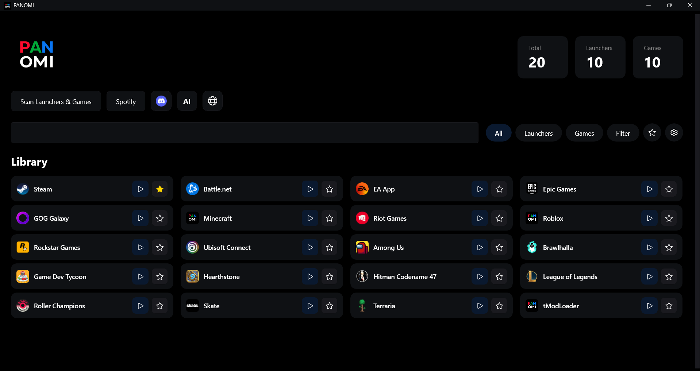

# PANOMI

**One launcher for all your games.**

PANOMI automatically detects your installed game launchers and games, giving you a unified library to browse and launch everything from one place.



## Features

- 🎮 **Auto-detection** - Finds Steam, Epic Games, GOG Galaxy, EA App, Ubisoft Connect, Battle.net, Riot Games, Rockstar Games, Minecraft, and Roblox
- 🚀 **Quick Launch** - Minimize to tray for instant access
- 🌍 **29 Languages** - English, Español, Português, Français, Deutsch, Italiano, 한국어, 日本語, 中文, हिन्दी, Русский, Polski, Türkçe, العربية, اردو, Українська, Indonesia, Tiếng Việt, ไทย, فارسی, বাংলা, Kiswahili, Ελληνικά, Română, Čeština, Српски, Nederlands, Shqip, Tagalog
- 🖥️ **Fullscreen Mode** - Controller-friendly big picture experience
- 🔄 **Auto-updates** - Seamless updates via Velopack

## Privacy & Security

- ✅ **No telemetry** - Zero data collection
- ✅ **No accounts** - Works completely offline
- ✅ **Local only** - All data stays on your PC
- ✅ **Open source** - MIT licensed, audit the code yourself
- ✅ **Signed & Certified** - Code signed with Microsoft Azure Trusted Signing certificate

## How It Works

PANOMI reads Windows registry entries and launcher configuration files to detect installed games. It does not modify any files or settings - it only reads existing data.

**Detection sources:**
- Registry keys (HKLM/HKCU software entries)
- Steam `.acf` manifests
- Epic Games `.item` manifests
- GOG Galaxy database
- EA App/Ubisoft Connect local configs

## System Requirements

- Windows 11 (x64)
- .NET 8 Runtime (included in installer)

## Download

Get the latest release from [GitHub Releases](https://github.com/dorsaljr/PANOMI_BETA/releases) or visit [panomi.org](https://panomi.org).

## Building from Source

```powershell
git clone https://github.com/dorsaljr/PANOMI_BETA.git
cd PANOMI_BETA
dotnet build src/Panomi.UI/Panomi.UI.csproj -c Release -p:Platform=x64
.\src\Panomi.UI\bin\x64\Release\net8.0-windows10.0.19041.0\Panomi.UI.exe
```

## Project Structure

```
src/
├── Panomi.Core/        # Models, interfaces
├── Panomi.Data/        # SQLite database layer
├── Panomi.Detection/   # Launcher & game detection
└── Panomi.UI/          # WinUI 3 application
```

## Disclaimer

PANOMI is an independent application and is not affiliated with, endorsed by, or sponsored by any third-party software, services, or platforms referenced within the app. All trademarks and logos are the property of their respective owners.

PANOMI does not host, distribute, or modify any third-party software or content. All applications are launched from your local system, and all external links open in your default browser.

Some links may be affiliate links, which help support PANOMI at no extra cost to you. As an Amazon Associate, I earn from qualifying purchases.

## License

[MIT License](LICENSE) - Free and open source.

## Links

- [Website](https://panomi.org)
- [Linktree](https://linktr.ee/panomiltd)
- [GitHub](https://github.com/dorsaljr/PANOMI_BETA)

